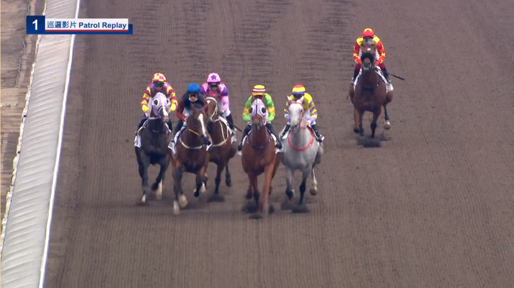
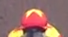
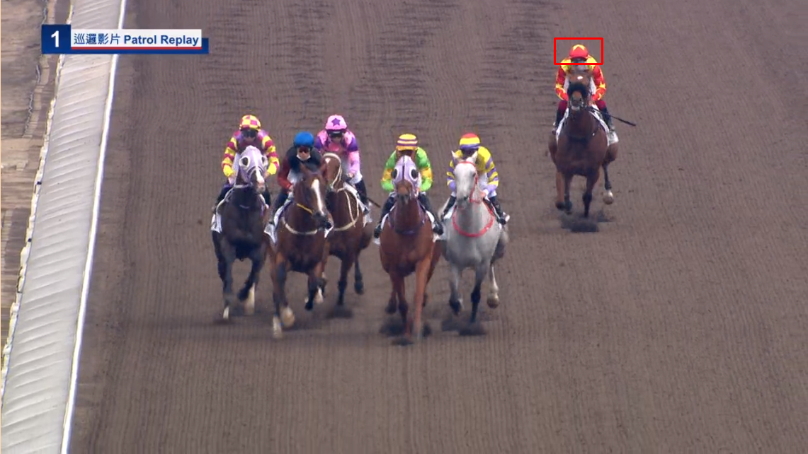

# Template Matching using OpenCV

This repository contains a Python script for performing template matching using OpenCV. The script utilizes the `cv2.matchTemplate()` function, which compares a template image to a source image and returns a match score for each location of the template in the source image. The script also uses the `cv2.minMaxLoc()` function to find the location of the best match.

## Requirements

- Python 3.10.9
- Numpy
- Matplotlib
- OpenCV

## Usage

The script takes in three command line arguments: the path to the source image, the path to the template image and output file name. Example usage:

```py
python template_matching.py -s source.png -t template.png -o output
```

The script will output the location of the best match, as well as save the source image with a rectangle drawn around the matched region.

Note:-

Please make sure that the template image is smaller than the source image.

| Source Image  | Template Image  |  Output Image |
|---|---|---|
|   |    |    |

## Further customization

You can also use different methods of comparison like cv2.TM_CCOEFF, cv2.TM_CCOEFF_NORMED, cv2.TM_CCORR, cv2.TM_CCORR_NORMED, cv2.TM_SQDIFF, cv2.TM_SQDIFF_NORMED and see the difference in results.

## Development

### Getting Started

- Clone the repository
- Install the dependencies
- Run the script

### Contributing

- Fork the repository
- Create your feature branch (`git checkout -b my-new-feature`)
- Commit your changes (`git commit -am 'Add some feature'`)
- Push to the branch (`git push origin my-new-feature`)
- Create a new Pull Request

### Author

[Ashish Kumar](ashish.krb7@gmail.com)

### License

This project is licensed under the MIT License - see the [LICENSE.md](./LICENSE.md) file for details.
